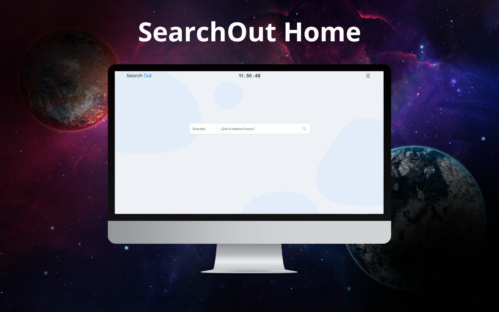

# SearchOut Home - Chrome Extension 🚀

A customizable new tab page Chrome extension designed for quick and private searching, enhanced productivity, and a personalized browsing experience. SearchOut Home replaces your default new tab page with a feature-rich dashboard, providing instant access to search, bookmarks, time, weather, notes, and more. It aims to streamline your workflow and make your browsing more efficient and enjoyable. To explore different SearchOut-based projects, you can browse my other repositories!

## 🚀 Key Features

- **Instant Search:** Quickly search the web using your preferred search engine with autocomplete suggestions. 🔍
- **Customizable Bookmarks:** Easily add, manage, and access your favorite websites directly from the new tab page. 🔖
- **Real-time Clock:** Stay on schedule with a prominently displayed, real-time clock. ⏰
- **Weather Updates:** Get current weather information for your location. ☀️
- **Focus Mode:** Minimize distractions and concentrate on your tasks. 🧘
- **To-Do List:** Keep track of your tasks and stay organized. ✅
- **Notes:** Jot down quick notes and ideas. 📝
- **Search Trends:** Stay updated with the latest search trends. 🔥
- **Background Customization:** Personalize your new tab page with custom background images. 🖼️
- **Reminders:** Set reminders to stay on top of important events. 🔔
- **Time Saved Tracking:** Track how much time you've saved using the extension. ⏳
- **Quotes:** Get inspired with daily quotes. 💡
- **Settings:** Customize the extension to fit your needs. ⚙️

## 🛠️ Tech Stack

- **Frontend:**
    - HTML5
    - CSS3
    - JavaScript (ES6+)
- **JavaScript Libraries:**
    - jQuery
- **CSS Framework:**
    - Bootstrap
- **Chrome Extension API**
- **External API:**
    - `https://onurb.me/api/searchout/autocomplete.php` (Autocomplete suggestions)
- **Data Storage:**
    - Local Storage (Bookmarks, Settings)

## 📦 Getting Started

### Prerequisites

- Google Chrome browser installed.

### Installation

1.  Download the repository as a ZIP file.
2.  Unzip the downloaded file to a directory of your choice.
3.  Open Chrome and navigate to `chrome://extensions/`.
4.  Enable "Developer mode" in the top right corner.
5.  Click "Load unpacked" and select the directory where you unzipped the extension files.

### Running Locally

Once installed, the extension will automatically replace your new tab page. Simply open a new tab in Chrome to start using SearchOut Home.

## 💻 Usage

- **Search:** Type your search query in the input field and press Enter or select a suggestion.
- **Bookmarks:** Click the "+" icon to add a new bookmark. Manage existing bookmarks through the settings.
- **Settings:** Click the settings icon to customize the extension's behavior and appearance.
- **Other Features:** Explore the various icons and elements on the new tab page to access features like weather, notes, and focus mode.

## 📂 Project Structure

```
SearchOut Home/
├── manifest.json          # Extension metadata and configuration
├── index.html             # Main HTML file for the new tab page
├── popup.html             # HTML file for the extension popup
├── static/                # Static assets
│   ├── style/           # CSS stylesheets
│   │   ├── style.css    # Custom styles
│   │   └── bootstrap.min.css # Bootstrap CSS
│   └── scripts/         # JavaScript files
│       ├── main.js      # Main JavaScript file
│       ├── reminders.js # Reminders functionality
│       ├── background.js # Background image functionality
│       ├── time_saved.js # Time saved tracking functionality
│       ├── search_trends.js # Search trends functionality
│       ├── settings.js  # Settings functionality
│       ├── bookmarks.js # Bookmarks functionality
│       ├── weather.js   # Weather functionality
│       ├── quotes.js    # Quotes functionality
│       ├── focus.js     # Focus mode functionality
│       ├── todo.js      # To-do list functionality
│       └── notes.js     # Notes functionality
├── LICENSE              # License information
└── README.md            # Project documentation (this file)
```

## 📸 Screenshots



## 🤝 Contributing

Contributions are welcome! Please fork the repository and submit a pull request with your changes.

## 📝 License

This project is licensed under the [MIT License](LICENSE).

## 📬 Contact

If you have any questions or suggestions, feel free to contact me at [bruno08rodriguez@gmail.com](mailto:bruno08rodriguez@gmail.com).

## 💖 Thanks

Thank you for using SearchOut Home! I hope it enhances your browsing experience and helps you stay productive.
